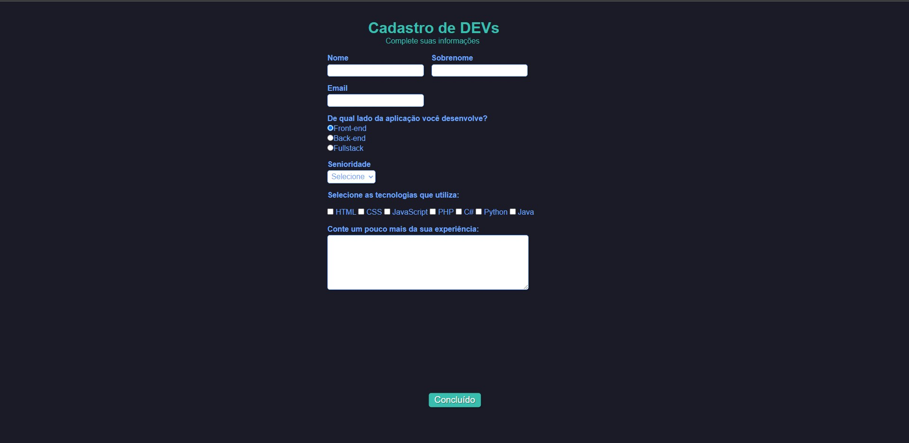

# 💡Formulário (guiado)

## Resultado

## Descrição

Esse final de semana mergulhei nos estudos de HTML e CSS e consegui construir meu primeiro projeto com HTML e CSS.
Ambas linguagens são de extrema importância (de marcação e
estilização) para o desenvolvimento front-end e por esse motivo
estou no caminho para me especializar na área
Esse foi o primeiro de muitos projetos que estão por vir, então se você quiser acompanhar meus novos projetos e aprender junto comigo me siga aqui no Github!